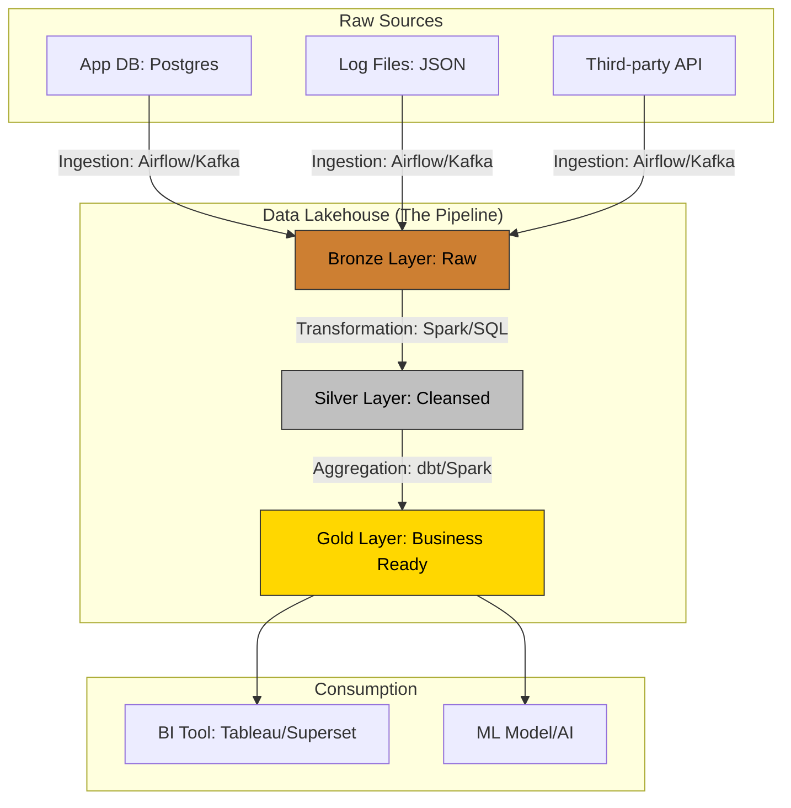

---
## 목차
4
{: .prompt-info }

---

## 1. 데이터 아키텍쳐 시각화
**데이터 엔지니어링은 결국 "데이터의 흐름(Flow)을 설계하고 관리하는 일"입니다.** 
앞서 저희가 했었던 **리눅스와 우분투, 도커**등도 결국 이러한 흐름을 설계하는 핵심도구 중 하나입니다.

이러한 아키텍쳐를 `Mermaid`로 시각화 해보겠습니다.

### 1-1 Raw sources 
> 데이터는 비즈니스가 일어나는 곳에서 발생하며, 분석을 위해 태어나지 않는다.

데이터 엔지니어가 가장 먼저 마주하는 데이터입니다.

- **종류**:

    - **RDB (Postgres, MySQL 등)**: 서비스 운영에 쓰이는 DB입니다. (예: 저희가 만든 `orders` 테이블)

    - **Logs** (JSON, Text): 사용자가 클릭할 때마다 쌓이는 기록입니다. "누가, 언제, 어디서"를 담고 있죠.

    - **External API**: 구글 광고 데이터나 날씨 정보처럼 외부에서 빌려오는 데이터입니다.

- **특징**: 매우 불친절합니다. 형식이 제각각이고, 갑자기 데이터가 안 들어오기도 하며, 운영 DB의 성능을 위해 우리가 데이터를 가져가는 걸 싫어하기도 합니다.

- **DE의 역할**: 운영 시스템에 무리를 주지 않으면서, 이 혼돈의 데이터를 안전하게 '복제'해오는 것입니다.

### 1-2 Bronze Layer
> 원본 데이터(Raw Data)는 불변(Immutable)해야 하며, 무결해야한다.

이곳은 앞으로 저희가 같이 진행할 소스 시스템에서 가져온 데이터를 **'있는 그대로'** 저장하는 곳입니다.

- **하는 일**: 데이터의 형식을 바꾸지 않고 그대로 저장소(Data Lake)에 쌓습니다.

- **중요성**: 나중에 분석 로직이 틀렸다는 걸 깨달았을 때, 원본이 없다면 끝장입니다. 브론즈 레이어가 있기에 우리는 언제든 **과거로 돌아가 다시 계산(Reprocessing)**할 수 있습니다.

- **핵심 기술**: Airflow(스케줄링), Kafka(실시간 스트리밍), AWS S3(저장).

- **DE의 역할**: "어제 데이터가 왜 안 들어왔지?"라는 질문에 당당하게 "원본은 여기 안전하게 있습니다!"라고 말할 수 있는 시스템을 구축하는 것입니다.

**원칙**: 소스 시스템에서 가져온 데이터를 있는 그대로 저장한다.

**이유**: 나중에 로직이 바뀌거나 데이터가 유실되었을 때, 원본이 있어야만 처음부터 다시 계산(Reprocessing)할 수 있기 때문입니다.

**DE의 업무**: API 호출, DB 복제(CDC), 파일 전송 등을 자동화하여 안정적으로 데이터를 퍼 올립니다.

### 1-3 Silver Layer
> 데이터는 맥락(Context)이 부여될 때 비로소 정보(Information)가 된다.

브론즈의 거친 원석을 깎고 씻어서 쓸만하게 만드는 단계입니다.

- **하는 일**:

    - **Cleaning**: 오타 수정, 결측치(Null) 처리, 중복 제거.

    - **Schema Enforcement**: 날짜 형식을 통일하고 숫자가 들어갈 자리에 문자가 있는 걸 골라냅니다.

    - **Join**: 여러 소스에서 온 데이터를 합칩니다. (예: 주문 데이터 + 고객 상세 정보)

- **핵심 기술**: Spark(대용량 처리), dbt(SQL 기반 변환), Python.

- **DE의 역할**: 분석가들이 "데이터가 왜 이렇게 지저분해요?"라고 묻지 않게, 깔끔하고 일관성 있는 데이터를 제공하는 것입니다.

### 1-4 Gold Layer
> 데이터 소비자는 시스템의 복잡함을 알 필요가 없어야 한다.

비즈니스 질문에 즉시 답할 수 있도록 최종 가공된 '다이아몬드'입니다.

- **하는 일**:

    - **Aggregation**: "일별 매출 합계", "지역별 인기 상품" 등 미리 계산된 테이블을 만듭니다.

    - **Optimization**: 읽기 속도를 극대화하기 위해 데이터를 정렬하고 압축합니다.

- **핵심 기술**: Data Warehouse (BigQuery, Snowflake), dbt.

- **DE의 역할**: "우리 서비스의 지난달 재방문율은?"이라는 질문에 단 1초 만에 쿼리 결과가 나오도록 완벽한 요약본을 만들어두는 것입니다.

### 1-5 Consumption
> 사용되지 않는 데이터는 비용일 뿐이며, 가치는 활용에서 나온다.

공들여 만든 데이터가 드디어 세상을 바꾸는 순간입니다.

- **활용처**:

    - **BI Dashboard**: 대표님이 아침마다 확인하는 지표 판넬.

    - **ML Model**: 추천 알고리즘 (예: "ㅇㅇ님 이 강의는 어떠세요?").

    - **Data API**: 다른 서비스에서 이 정제된 데이터를 다시 호출해서 사용.

- **DE의 활용**: 데이터가 최종 사용자에게 전달되기까지 **지연 시간(Latency)**을 줄이고, 항상 최신 상태를 유지하는 것입니다.