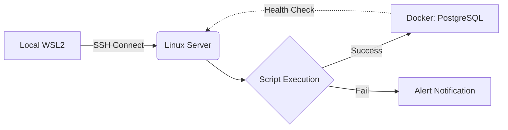

> **Enzo's Engineering Philosophy**
> "문제를 가장 작은 단위로 쪼개어 본질을 파악하는 '제1원칙 사고'는 데이터 엔지니어링의 핵심입니다. 맥북 프로 M5라는 강력한 무기와 함께 전성기 제2막을 열어보겠습니다."
{: .blockquote }

---

## 1. 데이터 흐름 시각화 (Mermaid)
복잡한 아키텍처를 캡처 이미지 없이 텍스트만으로 그려낼 수 있습니다. 현재 학습 중인 리눅스 기반 스크립트의 흐름을 시각화해 보겠습니다.



    
```bash
#!/bin/bash
# Docker DB 컨테이너 상태를 점검하는 쉘 스크립트

DB_NAME="jongsun-db"
STATUS=$(docker ps -f "name=$DB_NAME" --format "{{.Status}}")

if [ -z "$STATUS" ]; then
    echo "⚠️  Alert: $DB_NAME is down!"
else
    echo " Success: $DB_NAME is running ($STATUS)"
fi
```